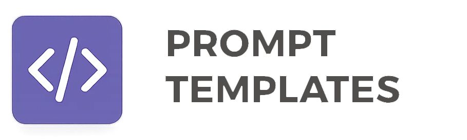
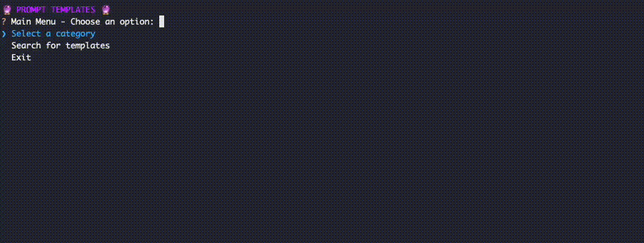

# Prompt Templates



A collection of reusable prompt templates for various domains, including coding, communication, creative writing, data analysis, design, documentation, frameworks, productivity, and more. This repository is organized for easy integration and extension that is accessable via an cli command

--> Still under construction

## Features
- Modular template structure by domain and use case
- Easily extendable with new templates
- CLI utilities for managing and rendering templates




## Directory Structure
```
prompt_templates/
  cli/                # CLI utilities for template management
  templates/          # All prompt templates organized by domain
    base_template/
    coding/
    communication/
    creative_writing/
    data_analysis/
    design_ux/
    documentation/
    frameworks/
    general/
    learning_research/
    productivity_planning/
    role_based/
    understanding/
  tests/              # Test suite for templates
```

## Installation

### 1. Clone the repository
```bash
git clone https://github.com/dvlunel/prompt-templates.git
cd prompt-templates
```

### 2. (Recommended) Create a virtual environment
```bash
python3 -m venv venv
source venv/bin/activate
```

### 3. Install package
```
pip install -e .
```

## Usage

You can use the CLI utilities to manage and render templates. For example:

```bash
prompt-templates
```

This will show available commands and options.

## Running Tests

To run the test suite:
```bash
pytest -v
```

## Contributing

Contributions are welcome! Please open issues or submit pull requests for new templates or improvements.

## License

This project is licensed under the terms of the LICENSE file in this repository.
